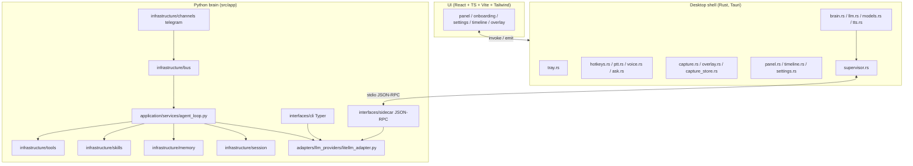

# Nova / Ruòxī Architecture Summary

Nova (若曦, *Ruòxī*) is a local-first desktop AI companion. It runs as a Rust
Tauri shell that supervises a Python "brain" sidecar, with CLI and Telegram
interfaces talking to the same brain. This document describes what actually
runs today, and separates the live runtime from the code sitting in
`legacy/`.

## Three Front Doors

1. **Desktop companion (primary).** The Tauri shell (`shell/`) supervises the
   Python brain as a sidecar (`src/app/interfaces/sidecar`) over
   newline-delimited JSON-RPC on stdio; the shell spawns it automatically. Run
   with `make shell` (static UI build, no hot reload) or `make shell-dev`
   (Vite dev server on :5173 plus a `tauri dev` watcher).

2. **CLI.** `nova` is a Typer app at `src/app/interfaces/cli/app.py` with its
   own inline tool-calling loop and commands `onboard`, `chat`, and `status`.
   Run with `make run-cli` or `uv run nova`.

3. **Telegram daemon.** `python -m src.app.main` starts an asyncio MessageBus,
   an AgentLoop, and a TelegramChannel.

## Component Map



## Python Brain (`src/app`)

Clean/hexagonal layering: interfaces at the edge, application services in the
middle, ports and adapters around them, infrastructure at the bottom.

### `interfaces/`

- `cli/`: Typer app at `app.py`. Runs its own inline tool-calling loop.
- `sidecar/`: JSON-RPC server over stdio. Methods: `ping`, `health`,
  `session.ask`, `session.abort`; notification `agent.token`; streamed tokens;
  offline gate; vision (captures are base64-encoded into `image_url` content
  blocks); a memory hit block with citation rules; and a post-check that
  strips bogus `[mem_*]` / `[cap_*]` citations. LLM streaming goes through
  LiteLLM using env config `RUOXI_LLM_BASE_URL`, `RUOXI_LLM_API_KEY`,
  `RUOXI_LLM_MODEL`, `RUOXI_LLM_VISION_MODEL`, and `RUOXI_OFFLINE`. A
  `RUOXI_LLM_MOCK` mode exists, and there is a graceful "not configured"
  message when no endpoint or key is set. It now runs the agentic tool loop
  per RFC-0007: tool schemas go to the LLM, tool calls execute by proxying
  upstream RPC methods to the shell, and a hard budget of 3 tool steps
  (`_MAX_TOOL_STEPS = 3`) forces a wrap-up turn when exhausted ("Tool budget
  exhausted — answer now from what you have."). An `agent.tool_step`
  notification (`{step, of: 3, tool}`) feeds panel progress, and a memory
  digest layer (`memory.digest` upstream) is injected into the system prompt as
  "Known facts about this user".

**Bidirectional RPC.** The sidecar does not only answer the shell. It also
*issues* upstream requests back to the shell, for example `capture.lookup`
(fetch a capture record including `abs_path`) and `memory.search` (`k=5`
hits). The Rust shell answers those requests.

### `application/services/`

- `agent_loop.py`: bus-driven orchestrator. Context assembly, then a
  tool-calling while loop, then session save plus memory consolidation.
- `llm_validator.py`.

### `domain/`

- `ports/llm_client_port.py`: abstract LLM port.
- `parsers/`.

### `adapters/`

- `config.py`: pydantic-settings plus `.env`.
- `llm_providers/litellm_adapter.py`: multi-provider support via LiteLLM.
- `memory/in_memory_adapter.py`: imports a port that does not exist (dead
  code, see Legacy).

### `infrastructure/`

- `tools/`: base plus registry, and filesystem, shell, web, and cron tools.
  OpenAI function schemas are generated from Pydantic params.
- `skills/`: `SKILL.md` loader and context builder, builtin skills for web,
  weather, github, notes, todo, and memory, plus bootstrap persona files
  (`SOUL`, `AGENTS`, `USER`, `TOOLS`, `MEMORY`, `HEARTBEAT`).
- `memory/`: two-layer Markdown, `MEMORY.md` for durable facts and
  `HISTORY.md` as a searchable log, with LLM consolidation.
- `session/`: Pydantic sessions persisted as JSON, keyed `channel:chat_id`.
- `bus/`: asyncio queues plus inbound/outbound event dataclasses.
- `channels/`: telegram.
- `cron/` and `heartbeat/`: services.

## Desktop Shell (`shell/`)

Rust lives in `shell/src-tauri/src/`:

- `tray.rs`: tray menu (Show result panel, Pause captures, Offline mode,
  Settings, Open timeline, About, Quit). Icon variants with precedence
  offline > paused > idle.
- `hotkeys.rs`: capture hotkeys `Alt+Shift+R/W/F`.
- `ptt.rs`: push-to-talk, `F8` by default, rebindable, using a macOS event tap.
- `voice.rs`: voice input (RFC-0004). Records mono 16 kHz samples during the
  push-to-talk hold and transcribes them with a vendored whisper.cpp engine
  (parakeet-class models).
- `ask.rs`: capture-scoped voice ask (RFC-0002 section 4.4). While the result
  panel is visible, push-to-talk asks about the capture on screen. Owns the
  single microphone slot shared by both routes, with the event contract
  `panel:listening` → `panel:transcribing` → `panel:transcript`
  (`panel:ask_cancelled` on Esc, hide, or empty speech).
- `capture.rs` (with `xcap` bitmaps), `overlay.rs` (region selection overlay),
  `capture_store.rs` (SQLite index plus PNG files, sha256 dedupe).
- `panel.rs`, `settings.rs` (`settings.json` in the app data dir, with `stt`,
  `tts`, and `llm` sections), `timeline.rs`, `displays.rs`.
- `permissions.rs`: TCC checks for Screen Recording, Microphone, Accessibility.
- `supervisor.rs`: spawns the sidecar, pings every 5s, respawns with backoff,
  and injects LLM env.
- `brain.rs`: `BrainLink` with `session.ask` / `session.abort`.
- `llm.rs`: API key stored in the macOS Keychain, plus `env_for_sidecar()`.
- `memory.rs`: memory store (RFC-0006). Episodic, semantic, and procedural
  entries as Markdown plus front-matter under the shell app data dir, with a
  rebuildable SQLite FTS index (files are the source of truth, the index is a
  cache). Implements the shell's `RequestRouter` and answers the sidecar's
  upstream `memory.search`.
- `models.rs`: STT model manager with a catalog, consent-based download, sha256
  verification, and select/delete; parakeet-class models for the vendored
  whisper.cpp engine.
- `tts.rs`: text-to-speech with local Kokoro voices plus system-voice fallback
  (list/test/save commands).

`lib.rs` wires a push-to-talk release to `voice::transcribe`; a non-empty
transcript is sent as `session.ask` and the panel opens, while an empty
transcript logs "no speech detected".

The shell is a single-instance macOS accessory app (no Dock icon).

**UI** (`shell/ui`, React + TS + Vite + Tailwind): views are selected via
`?view=` and cover panel, onboarding, settings, timeline, and overlay.

**IPC.** UI to Rust uses Tauri `invoke`/`emit`. Rust to Python uses stdio
JSON-RPC in both directions.

## Data Flows

**Desktop ask.** UI sends a request through Tauri invoke to the Rust shell.
The shell's `BrainLink` frames a `session.ask` JSON-RPC request to the Python
sidecar over stdio. The sidecar may issue `capture.lookup`, `memory.search`, or
`memory.digest` back upstream; the shell answers. While answering it runs the
at-most-3-step tool loop (proxying tool calls upstream and emitting
`agent.tool_step` progress) and streams tokens back as `agent.token`
notifications, which the shell emits to the UI.

**Telegram.** Telegram update lands in the TelegramChannel, which publishes to
the asyncio MessageBus. `AgentLoop` consumes it, assembles context, runs the
tool-calling loop, saves the session, consolidates memory, and writes the
reply back to the bus for the channel to send.

**Capture.** A hotkey or push-to-talk event triggers `capture.rs` to grab a
bitmap, `capture_store.rs` to hash and index it (SQLite plus PNG), and
`overlay.rs` to handle region selection.

**Voice ask.** A push-to-talk hold triggers `voice.rs` to record 16 kHz mono
audio; on release the recording is transcribed via whisper.cpp and
`panel:transcript` is emitted. The transcript then enters the same
`session.ask` streaming path as a typed ask, with empty speech dropped and Esc
cancelling. When the panel already shows a capture, `ask.rs` scopes the ask to
that capture and shares the one microphone slot.

## Storage

- **Brain**: `~/.nova/`. Contains `sessions/*.json`, `memory/MEMORY.md` plus
  `memory/HISTORY.md`, `skills/`, and `bootstrap/`.
- **Shell app data dir**: `settings.json`, the capture store (SQLite plus
  PNGs), the memory store (Markdown plus FTS index), and downloaded STT
  models.
- **Two memory systems**: the Python brain keeps its Markdown memory under
  `~/.nova/` for the CLI and Telegram paths, while the desktop ask path
  retrieves memories from the shell's `memory.rs` store via the upstream
  `memory.search` request.

## Directory Tree

```
nova-ai/
├── src/app/
│   ├── interfaces/
│   │   ├── cli/            # Typer app, inline tool loop
│   │   └── sidecar/        # JSON-RPC server over stdio
│   ├── application/services/
│   │   ├── agent_loop.py   # bus-driven orchestrator
│   │   └── llm_validator.py
│   ├── domain/
│   │   ├── ports/          # llm_client_port.py
│   │   └── parsers/
│   ├── adapters/
│   │   ├── config.py
│   │   ├── llm_providers/  # litellm_adapter.py
│   │   └── memory/         # in_memory_adapter.py (dead)
│   └── infrastructure/
│       ├── tools/          # base, registry, fs/shell/web/cron
│       ├── skills/         # SKILL.md loader, builtins, bootstrap
│       ├── memory/         # MEMORY.md + HISTORY.md
│       ├── session/        # JSON sessions
│       ├── bus/            # asyncio queues + events
│       ├── channels/       # telegram
│       ├── cron/
│       └── heartbeat/
├── shell/
│   ├── src-tauri/src/      # tray, hotkeys, ptt, capture, panel, ...
│   └── ui/                 # React + TS + Vite + Tailwind views
├── legacy/                 # old code, not used
│   └── archive/            # further archived code
├── langgraph.json          # dead config
├── docker-compose.yaml     # vestigial
├── Makefile
└── pyproject.toml
```

## Running

- `make shell`: install, build the UI, then run the tray shell (static, no hot
  reload).
- `make shell-dev`: Vite HMR plus `tauri dev`.
- `make shell-ui`: build the UI only.
- `make shell-test`: run cargo tests.
- `make test`: run Python tests via `uv run pytest`.
- `make run-cli`: run the CLI.

## Legacy / Stale

`legacy/` and `legacy/archive/` hold the old LangGraph `StateGraph`
orchestrator (8 nodes: intent, memory gate, recall/plan, LLM, write, output),
a FastAPI app, and old ports and entities. None of it is used. Other stale
items:

- `langgraph.json` points at `./src/studio.py:graph`, which does not exist
  (dead config).
- `docker-compose.yaml` declares redis and postgres, but nothing in the
  runtime uses them (vestigial).
- `adapters/memory/in_memory_adapter.py` imports a port that does not exist
  (dead code).
- `langchain` and `langgraph` remain in `pyproject.toml`, but the live runtime
  is the hand-written loop. LiteLLM is the LLM adapter.

## Status

Shell surfaces (tray, hotkeys, capture/overlay, timeline, settings) are
M0-complete. Voice input (M1), the agentic tool loop (RFC-0007: 3-step budget,
tool progress, digest layer), and memory (M2: store, grounding, citation
guard) have landed. The desktop ask path runs the LLM → tools → streamed
answer loop end to end.

## Related Docs

- `docs/SYSTEM_FLOW.md`: mermaid flow diagrams, current.
- `docs/DESIGN.md`: design system.
- `docs/rfc/RFC-0001` through `RFC-0010`.
- `docs/ruoxi_prd.md`.
- `shell/README.md`.
- `plans/m0-build-plan.md`.

---

Last Updated: 2026-09-20
