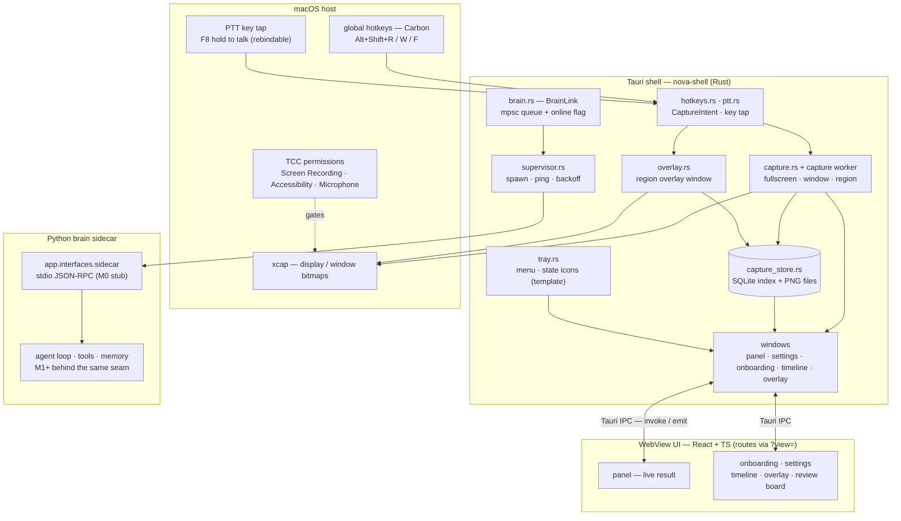
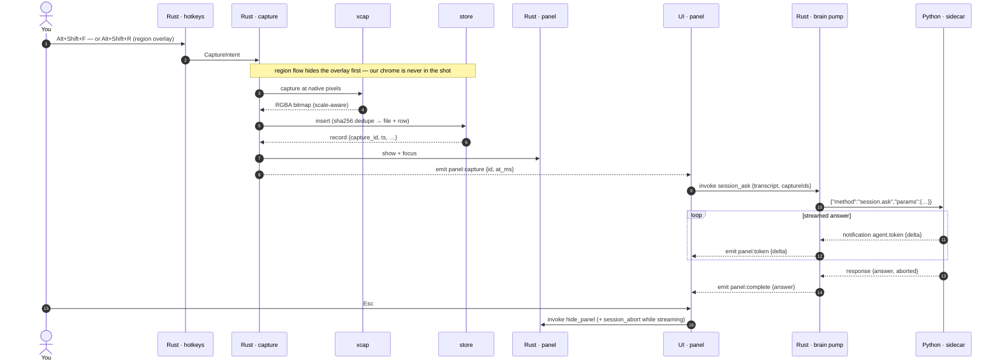
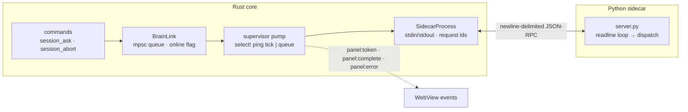
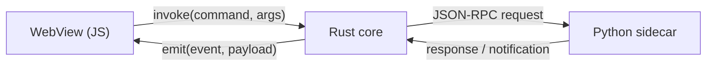
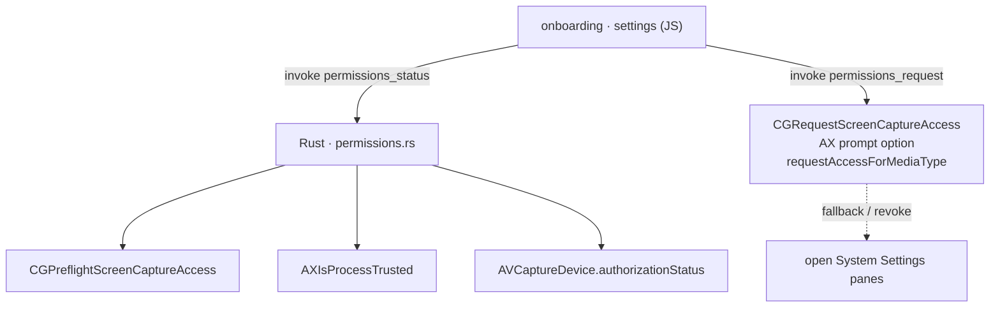
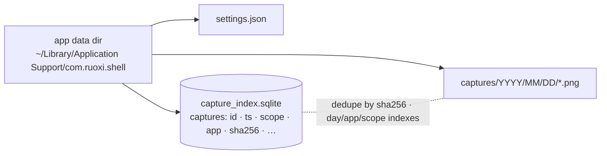

# Ruòxī — system flow (shell · brain · ui)

How the pieces talk. The **Tauri shell (Rust)** owns the windows, capture, tray and the
sidecar; the **WebView UI (React + TS)** renders every surface; the **Python brain
sidecar** answers over stdio JSON-RPC. Every name below matches the code:
`shell/src-tauri/src/`, `shell/ui/src/`, `src/app/interfaces/sidecar/`.

Related: [RFC-0002](rfc/RFC-0002-platform-shell.md) (shell) · [RFC-0003](rfc/RFC-0003-screen-capture.md)
(capture) · [DESIGN.md](DESIGN.md) (contract) · [shell/README](../shell/README.md).

**M0 note:** `session.ask` streams a *canned* answer from the stub sidecar — the real
agent loop (tools, memory, LLM routing) lands behind the same seam in M1+.

## 1 · Component map

## 2 · Capture → answer (the full loop)

## 3 · Sidecar supervision + brain link

- **Spawn:** `settings.json → sidecar_command` / `sidecar_args` (e.g. the repo
  `.venv/bin/python -m app.interfaces.sidecar`).
- **Health:** `ping` every `ping_interval_secs` (default 5 s, 3 s timeout).
- **Restart:** exponential backoff (1, 2, 4, 8, 16 s, max 5) → then the tray tooltip
  says the brain is offline.
- **While an ask streams:** a queued `session.abort` is written immediately; other
  requests wait behind the stream (30 s ask timeout → `panel:error`).

## 4 · IPC surfaces (three hops)

**JS → Rust — `invoke` commands (Tauri):**
`get_settings` · `set_settings` · `show_settings` · `show_onboarding` ·
`show_panel` · `hide_panel` · `session_ask` · `session_abort` ·
`permissions_status` · `permissions_request` · `open_privacy_pane` ·
`capture_store_stats` · `capture_delete_all` · `show_timeline` · `timeline_list` ·
`capture_thumbnail` · `list_displays` · `start_region_capture` · `overlay_cancel` ·
`capture_region_commit` · `validate_hotkey`

**Rust → JS — `emit` events:**
`panel:capture {id, at_ms}` · `panel:token {delta}` · `panel:complete {answer}` ·
`panel:error {message}` · `settings:changed {…settings}`

**Rust ⇄ Python — stdio JSON-RPC (newline-delimited):**
requests `ping` · `session.ask {transcript, capture_ids}` · `session.abort {}`;
notifications `agent.token {answer_id, delta}`; responses `{answer_id, answer, steps, aborted}`.

## 5 · Permissions & first run

- The setup ritual (J8, AC-12) shows a **why-line before each OS prompt**; the gate
  needs **Screen Recording + Accessibility** (the microphone is read but never blocks —
  macOS reports it as `unknown`/`not determined` honestly).
- Without **Screen Recording** macOS returns wallpaper-only captures (no other apps'
  windows); without **Accessibility** hold-to-talk cannot tap the keyboard.

## 6 · Storage

